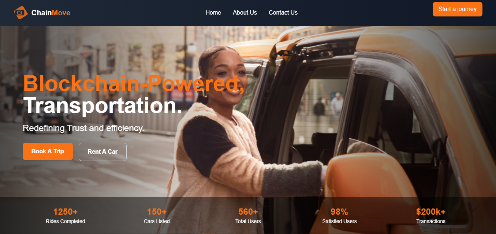

# 🚗 ChainMove – Decentralized Transportation on the Internet Computer

Welcome to **ChainMove**, a decentralized, blockchain-powered transportation platform that brings transparency, efficiency, and security to mobility services. Built on the **Internet Computer**, ChainMove leverages blockchain technology to create a seamless and trusted experience for drivers and passengers alike, ensuring secure payments, driver incentives, and ride transparency.

> **Hackathon Project**: Created for the Internet Computer Hackathon 2024. ChainMove reimagines ride-sharing with decentralization and transparency at its core. 🚀



## 🌟 Overview

ChainMove provides a decentralized platform for booking and managing rides, securely handled through smart contracts on the Internet Computer. With transparent payments and blockchain-based confirmations, riders and drivers can rely on secure, immutable transaction records.

Our platform ensures:
- **Initial payment security**: Drivers receive an upfront 10% payment upon booking.
- **Completion incentives**: Remaining payment is sent upon ride confirmation by the passenger.
- **User authentication**: All users are authenticated via **Internet Identity** for enhanced security.

## 🎯 Key Features

1. **Decentralized Ride Booking**: Passengers can book rides with secure, blockchain-based payment and confirmations.
2. **Driver Incentive Structure**: Drivers receive 10% of the fare immediately upon booking, and the remaining 90% upon passenger confirmation.
3. **Real-time Ride Updates**: Passengers and drivers can view ride status updates via the ChainMove interface.
4. **Internet Identity Integration**: Users are securely authenticated using Internet Identity, ensuring a safe and seamless experience.

## 🛠️ Technologies Used

ChainMove utilizes a modern technology stack to deliver a robust, decentralized platform on the Internet Computer.

- **Next.js** – Frontend framework for fast, responsive UI and seamless routing.
- **Motoko** – Backend smart contract language for securely handling ride bookings and payments.
- **Internet Identity** – Decentralized authentication provided by the Internet Computer for secure user login and identity management.
- **Tailwind CSS** – A utility-first CSS framework for rapid and flexible UI development.

## 📐 Project Architecture

ChainMove's architecture is composed of:

1. **Frontend**: Built with **Next.js** for client-side routing and a responsive user experience.
2. **Backend**: **Motoko** smart contracts manage ride bookings, payments, and confirmations on the blockchain.
3. **Authentication**: **Internet Identity** ensures a decentralized, secure login experience for drivers and passengers.
4. **Payment Flow**: Funds are transferred based on contract logic—10% to the driver on booking, and 90% upon completion confirmation by the passenger.

## 🚀 Getting Started

To get ChainMove running on your local setup, follow these steps.

### Prerequisites

1. **Node.js** (v14+)
2. **dfx** (Internet Computer SDK)
3. **npm** 

### Installation

1. **Clone the repository**:

   ```bash
   git clone https://github.com/obiajulu-gif/chainmove.git
   cd chainmove
   ```

2. **Install dependencies**:

   ```bash
   cd frontend
   npm install
   ```

3. **Set up environment variables**:

   Create a `.env.local` file in the `frontend` directory with the following contents:

   ```plaintext
   NEXT_PUBLIC_IC_HOST_URL=https://ic0.app
   NEXT_PUBLIC_TEST_CANISTER_ID=<your_canister_id>
   NEXT_PUBLIC_INTERNET_IDENTITY_URL=https://identity.ic0.app/#authorize
   ```

4. **Start the local development server**:

   In one terminal, run the Internet Computer:

   ```bash
   dfx start --clean
   ```

   In another terminal, deploy the project:

   ```bash
   dfx deploy
   ```

5. **Run the frontend**:

   ```bash
   npm run dev
   ```

Visit `http://localhost:3000` in your browser to access ChainMove.

## 💡 Smart Contract Overview

The ChainMove backend is implemented in **Motoko** and handles the following tasks:

1. **Ride Booking**: The contract logs ride details, including driver, passenger, and fare, and releases an initial payment (10%) to the driver upon booking.
2. **Ride Completion**: When the passenger confirms the ride completion, the contract transfers the remaining 90% of the fare to the driver.
3. **Driver Withdrawal**: Drivers can withdraw their accumulated earnings from completed rides.

### Motoko Contract Code Snippet

Here's a brief look at the core logic for ride booking and payments:

```motoko
actor BlockRide {
  type Ride = { passenger: Principal; driver: Principal; fare: Nat; status: Text };
  stable var rides : [Nat : Ride] = [];
  stable var driverBalances : [Principal : Nat] = [];

  public shared({caller}) func bookRide(driver: Principal, fare: Nat) : async Nat {
    let initialPayment = fare / 10;
    driverBalances[driver] := driverBalances.get(driver, Nat(0)) + initialPayment;
    let rideId = Nat(rides.size());
    rides[rideId] := { passenger = caller; driver = driver; fare = fare; status = "Booked" };
    return rideId;
  }

  public shared({caller}) func completeRide(rideId: Nat) : async Text {
    let ride = rides[rideId];
    let remainingPayment = ride.fare - (ride.fare / 10);
    driverBalances[ride.driver] := driverBalances.get(ride.driver, Nat(0)) + remainingPayment;
    rides[rideId].status := "Completed";
    return "Ride completed, payment transferred.";
  }
}
```

> This contract enforces ChainMove’s unique 10/90 payment split to reward drivers upfront and protect passenger funds until the ride is completed.

## 🔒 Authentication with Internet Identity

Internet Identity is used to authenticate both drivers and passengers on ChainMove. This integration ensures that user sessions are secure, decentralized, and managed entirely on the Internet Computer blockchain.

1. **Login**: Internet Identity prompts users to authenticate when they access the platform.
2. **Session Management**: Once logged in, users can access their profiles, book rides, and manage their transactions.

## 📱 Screenshots

### Phone View Page


### Register Page


## 🤝 Team Members

Meet the talented team behind ChainMove:

- **Emmanuel Okoye** – *Team lead and Full Stack Developer*: Developed the Next.js frontend and implemented responsive UI components.
- **Damian Olebuezie** – *Lead Blockchain Developer*: Spearheaded the development of ChainMove's Motoko smart contracts, ensuring seamless and secure transaction flows.
- **Victoria Nwogu** – *Product Manager*: Managed project timelines and feature planning, ensuring ChainMove meets user needs effectively.
- **David Emulo** – *UI/UX Designer*: Designed an intuitive user experience, from ride booking to payment confirmation, and crafted all visual assets.

## 🤝 Contributing

We welcome contributions to make ChainMove even better! Please fork the repository and submit a pull request, or reach out if you have ideas to improve the project.

## 📝 License

This project is licensed under the MIT License.

---

ChainMove is poised to transform the ride-sharing industry by putting control in the hands of the users. Join us in redefining decentralized transport on the Internet Computer!
